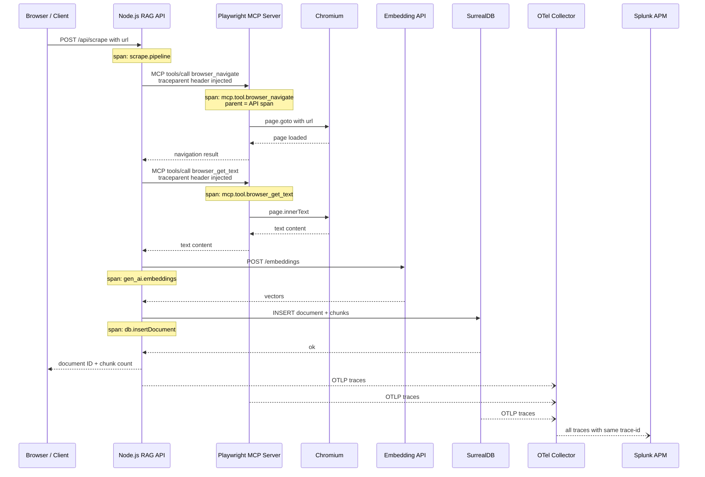

# Plan: 014 -- Integrate Playwright MCP for Web Scraping with Distributed OTel Tracing

## Problem / goal

Add a `POST /api/scrape` endpoint to the RAG API that accepts a URL,
calls the standalone Playwright MCP server to fetch and extract page
text, chunks it, generates embeddings, and stores everything in
SurrealDB -- exactly like the existing file upload pipeline but sourced
from a live web page.

Both systems (Node.js RAG API + Python Playwright MCP server) must
report OTel telemetry to the shared OTel Collector so that a single
trace in Splunk APM shows the full flow: user request -> RAG API ->
MCP tool call -> Playwright browser automation -> back to RAG API ->
embed -> store.

The two projects are deployed separately (different repos, different
containers). The RAG API discovers the Playwright MCP server via an
endpoint URL in `.env`.

---

## Architecture



---

## Key design decisions

### 1. MCP client in Node.js

Use `@modelcontextprotocol/sdk` (v1.30.0) with `StreamableHTTPClientTransport`.
The Playwright server uses `streamable_http_app(stateless_http=True)`, so
every request is independent -- no session management needed on the MCP
protocol layer (browser sessions are managed by the Playwright server
internally via its own session_create/session_close tools).

```
import { Client } from '@modelcontextprotocol/sdk/client/index.js';
import { StreamableHTTPClientTransport } from '@modelcontextprotocol/sdk/client/streamableHttp.js';
```

The transport accepts `requestInit.headers` for custom headers -- we pass
`x-api-key` for auth and `traceparent` / `tracestate` for W3C trace
context propagation.

### 2. Trace context propagation (Node.js -> Python)

The MCP SDK's `StreamableHTTPClientTransport` sends HTTP POST requests
to `/mcp`. The Node.js OTel auto-instrumentation (`@opentelemetry/auto-instrumentations-node`)
includes `@opentelemetry/instrumentation-http` which **automatically injects
`traceparent` and `tracestate` headers** into all outgoing HTTP requests
made via `http`/`https`/`fetch` when a span is active.

Since the MCP SDK uses `fetch` internally, the W3C trace context headers
will be injected automatically by the OTel SDK -- no manual propagation
code needed on the client side.

### 3. Trace context extraction (Python server side)

The Playwright MCP server needs to:
1. Extract `traceparent` from incoming HTTP headers
2. Create spans as children of the extracted context
3. Export spans via OTLP to the shared OTel Collector

Approach: Use `opentelemetry-instrumentation-asgi` middleware which
automatically extracts W3C trace context from incoming HTTP requests
and creates server spans. Then add manual spans for each MCP tool call.

The ASGI middleware wraps the app before the API key middleware:

```
app = mcp.streamable_http_app(stateless_http=True)
app = OpenTelemetryMiddleware(app)      # <-- new: extracts traceparent
app = APIKeyMiddleware(app)             # existing: checks x-api-key
app = _LifespanWrapper(app)             # existing: cleanup task
```

### 4. Separate deployment

The Playwright MCP server runs independently (its own Docker container,
its own repo). It is NOT added to the observability-test docker-compose.
The RAG API connects to it via a configurable URL in `.env`:

```
MCP_PLAYWRIGHT_URL=http://host.docker.internal:3010/mcp
MCP_PLAYWRIGHT_API_KEY=your-secret-key
```

For local dev, the Playwright server runs on the host (or in its own
Docker container) and the RAG API container reaches it via
`host.docker.internal`.

### 5. Scrape flow reuses existing pipeline

The scrape route reuses the existing `chunker.js` and `embeddings.js`
modules. The only new logic is:
1. Connect to MCP server
2. Create a browser session
3. Navigate to URL
4. Extract text
5. Close session
6. Pass text through the existing chunk -> embed -> store pipeline

---

## Changes to observability-test (this repo)

### New files

| File | Purpose |
|------|---------|
| `api/src/mcp-client.js` | MCP client wrapper -- connect, call tools, disconnect |
| `api/src/routes/scrape.js` | `POST /api/scrape` route |
| `api/src/__tests__/mcp-client.test.js` | Unit tests for MCP client |
| `api/src/__tests__/scrape.test.js` | Unit tests for scrape route |

### Modified files

| File | Change |
|------|--------|
| `api/src/index.js` | Register scrape route |
| `api/package.json` | Add `@modelcontextprotocol/sdk` dependency |
| `.env.example` | Add `MCP_PLAYWRIGHT_URL` and `MCP_PLAYWRIGHT_API_KEY` |
| `docker-compose.yml` | Pass new env vars to api service |
| `nginx/html/index.html` | Add URL input for scraping |
| `nginx/html/app.js` | Add scrape UI logic |
| `docs/opentelemetry.md` | Document distributed tracing across services |

### New dependency

```
npm install @modelcontextprotocol/sdk
```

This is the official MCP TypeScript SDK (v1.30.0). It provides
`Client` and `StreamableHTTPClientTransport` for connecting to
remote MCP servers over HTTP.

---

## Changes to Playwright-MCP-Demo (separate repo)

### New dependencies

```
pip install opentelemetry-api opentelemetry-sdk \
            opentelemetry-exporter-otlp-proto-http \
            opentelemetry-instrumentation-asgi
```

### Modified files

| File | Change |
|------|--------|
| `requirements.txt` | Add OTel packages |
| `server.py` | Add OTel SDK init + ASGI middleware + tool-level spans |
| `.env.example` | Add `OTEL_EXPORTER_OTLP_ENDPOINT`, `OTEL_SERVICE_NAME` |
| `Dockerfile` | No change needed (packages installed via requirements.txt) |

### OTel instrumentation approach

Add a new module or inline block at the top of `server.py` that:

1. Configures `TracerProvider` with OTLP HTTP exporter
2. Sets `service.name` = `playwright-mcp` (from env)
3. Sets W3C `TraceContextTextMapPropagator` as global propagator
4. Wraps the ASGI app with `OpenTelemetryMiddleware`
5. Optionally adds manual spans around each MCP tool function

The ASGI middleware handles trace context extraction automatically.
For tool-level visibility, we can add a decorator that creates a
child span for each `@mcp.tool()` function:

```python
from opentelemetry import trace
tracer = trace.get_tracer('playwright-mcp', '0.1.0')

# Decorator for MCP tools
def traced_tool(func):
    @wraps(func)
    async def wrapper(*args, **kwargs):
        with tracer.start_as_current_span(f'mcp.tool.{func.__name__}') as span:
            span.set_attribute('mcp.tool.name', func.__name__)
            try:
                result = await func(*args, **kwargs)
                return result
            except Exception as e:
                span.record_exception(e)
                span.set_status(StatusCode.ERROR, str(e))
                raise
    return wrapper
```

---

## Environment configuration

### observability-test `.env`

```
# --- MCP Services ---
MCP_PLAYWRIGHT_URL=http://host.docker.internal:3010/mcp
MCP_PLAYWRIGHT_API_KEY=your-secret-key
```

### Playwright-MCP-Demo `.env`

```
# --- OpenTelemetry ---
OTEL_EXPORTER_OTLP_ENDPOINT=http://host.docker.internal:4318
OTEL_SERVICE_NAME=playwright-mcp
OTEL_RESOURCE_ATTRIBUTES=deployment.environment=dev
```

Both services export to the same OTel Collector (port 4318 OTLP/HTTP).
The Collector already handles traces from the RAG API and SurrealDB.
Adding a third service requires zero Collector config changes.

---

## Distributed trace structure in Splunk

```
trace-id: abc123...
|
+-- [rag-api] POST /api/scrape (HTTP server span, auto)
    |
    +-- [rag-api] scrape.pipeline (manual span)
        |
        +-- [rag-api] POST http://playwright:3010/mcp (HTTP client span, auto)
        |   |
        |   +-- [playwright-mcp] POST /mcp (ASGI server span, auto)
        |       |
        |       +-- [playwright-mcp] mcp.tool.session_create (manual)
        |
        +-- [rag-api] POST http://playwright:3010/mcp (HTTP client, auto)
        |   |
        |   +-- [playwright-mcp] POST /mcp (ASGI server, auto)
        |       |
        |       +-- [playwright-mcp] mcp.tool.browser_navigate (manual)
        |
        +-- [rag-api] POST http://playwright:3010/mcp (HTTP client, auto)
        |   |
        |   +-- [playwright-mcp] POST /mcp (ASGI server, auto)
        |       |
        |       +-- [playwright-mcp] mcp.tool.browser_get_text (manual)
        |
        +-- [rag-api] POST http://playwright:3010/mcp (HTTP client, auto)
        |   |
        |   +-- [playwright-mcp] POST /mcp (ASGI server, auto)
        |       |
        |       +-- [playwright-mcp] mcp.tool.session_close (manual)
        |
        +-- [rag-api] gen_ai.embeddings (manual span)
        |
        +-- [rag-api] db.insertDocument (manual span)
        |
        +-- [rag-api] db.insertChunks (manual span)
```

Each `[playwright-mcp]` span is a child of the corresponding
`[rag-api]` HTTP client span because the W3C `traceparent` header
flows automatically via the OTel HTTP instrumentation.

---

## Edge cases / error states

- **Playwright MCP server unreachable**: Return 503 with clear message
- **MCP API key invalid**: Return 503 (MCP server returns 401/403)
- **URL navigation fails**: Return 400 with the navigation error
- **Page has no text content**: Return 400 with empty content message
- **MCP session cleanup on error**: Always close the browser session in
  a finally block, even if navigation or text extraction fails
- **Timeout**: MCP tool calls should have a reasonable timeout (30s for
  navigation, 10s for text extraction)
- **Large pages**: Truncate extracted text at a configurable limit
  (e.g. 100KB) to avoid embedding API limits

---

## Implementation checklist

### Part A: observability-test (this repo)

- [ ] Add `@modelcontextprotocol/sdk` to `api/package.json`
- [ ] Create `api/src/mcp-client.js` -- MCP client wrapper
- [ ] Create `api/src/routes/scrape.js` -- POST /api/scrape route
- [ ] Register scrape route in `api/src/index.js`
- [ ] Add `MCP_PLAYWRIGHT_URL` and `MCP_PLAYWRIGHT_API_KEY` to `.env.example`
- [ ] Pass new env vars in `docker-compose.yml`
- [ ] Add URL scrape UI to `nginx/html/index.html` and `nginx/html/app.js`
- [ ] Write unit tests for mcp-client.js
- [ ] Write unit tests for scrape route
- [ ] Update `docs/opentelemetry.md` with distributed tracing docs

### Part B: Playwright-MCP-Demo (separate repo)

- [ ] Add OTel packages to `requirements.txt`
- [ ] Add OTel SDK initialization to `server.py`
- [ ] Wrap ASGI app with `OpenTelemetryMiddleware`
- [ ] Add `traced_tool` decorator to MCP tool functions
- [ ] Add `OTEL_*` env vars to `.env.example`
- [ ] Test end-to-end trace propagation

---

## Out of scope

- Adding Playwright MCP to the observability-test docker-compose (user
  explicitly wants separate deployment)
- HTML parsing / PDF extraction (text-only via browser_get_text)
- Authentication/OAuth for the scrape endpoint itself
- Rate limiting on the scrape endpoint
- Caching scraped pages
- Recursive crawling / spidering

---

## Dependencies to add or upgrade

### observability-test

| Package | Version | Purpose |
|---------|---------|---------|
| `@modelcontextprotocol/sdk` | ^1.30.0 | MCP client for Node.js |

### Playwright-MCP-Demo

| Package | Version | Purpose |
|---------|---------|---------|
| `opentelemetry-api` | latest | OTel API |
| `opentelemetry-sdk` | latest | OTel SDK (TracerProvider) |
| `opentelemetry-exporter-otlp-proto-http` | latest | OTLP/HTTP exporter |
| `opentelemetry-instrumentation-asgi` | latest | ASGI middleware for auto trace extraction |

---

## Review notes

(To be filled during review)
