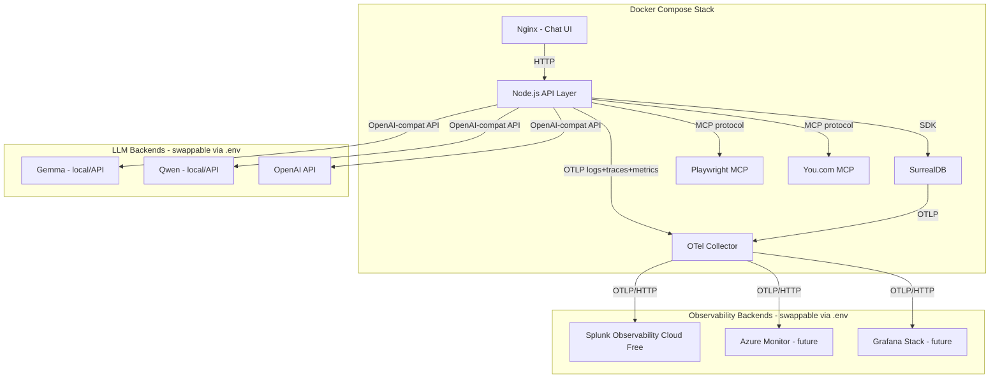

# Observability Test -- Project Setup Plan

## Overview

Set up a new project at `c:\Users\tom\dev\observability-test` using the
TLabs Project Tracking framework conventions from
`tlabs-project-tracking-main`. The project is a learning/testing ground for
observability across a Docker-deployed RAG agent stack, starting with Splunk
Observability Cloud (free edition), then expanding to Azure Monitor and
Grafana.

## Architecture



## Key Technical Decisions

### OpenTelemetry versions (as of August 2026)

- **OTel Collector**: v0.157.0 is the latest release (upstream). The Splunk
  Distribution bundles this. OTel graduated to CNCF top-tier in May 2026.
- **OTel JS SDK 2.x**: packages are `>=2.0.0` (stable) / `>=0.221.0`
  (unstable). Minimum Node.js: `^18.19.0 || >=20.6.0`. Key packages:
  - `@opentelemetry/api`
  - `@opentelemetry/sdk-node`
  - `@opentelemetry/auto-instrumentations-node`
  - `@opentelemetry/exporter-trace-otlp-http`
  - `@opentelemetry/exporter-metrics-otlp-http`
  - `@opentelemetry/exporter-logs-otlp-http`
  - `@opentelemetry/resources`
  - `@opentelemetry/semantic-conventions`
- **gen_ai semantic conventions**: The OTel Demo 3.0 (July 2026) added the
  `gen-ai normalizer processor` to the Collector for converting
  Traceloop/OpenLLMetry telemetry into official `gen_ai.*` semconv. This is
  the pattern to follow for LLM observability.
- **Instrumentation file**: Must load BEFORE any app code via
  `node --require ./src/instrumentation.js` (CJS) or `--import` (ESM).

### Splunk Observability Cloud Free Edition

- Launched June 2026 -- full features, limited by hosts not features.
- Supports LLM call tracing, tool invocation spans, and token cost metrics.
- Uses the Splunk Distribution of OTel Collector (or upstream collector).
- Requires: Splunk realm + access token (configured in `.env`).
- Smart Agent monitors are deprecated -- use native OTel receivers only.

### SurrealDB

- Multi-model database (document, graph, relational). Good fit for RAG
  (store documents + embeddings + graph relationships).
- Has a Node.js SDK (`surrealdb`).
- Runs as a Docker container.

### LLM swappability

- All LLM calls go through an OpenAI-compatible completions API.
- The endpoint URL and API key are in `.env`.
- Gemma and Qwen can be served locally via vLLM/Ollama (OpenAI-compat mode)
  or via cloud APIs.

## Project Directory Structure

```
observability-test/
  AGENTS.md                          -- Canonical charter (from framework, customised)
  CLAUDE.md                          -- Claude Code adapter (customised with build/test commands)
  CHANGELOG.md                       -- Project changelog
  NOTICE.md                          -- Attribution notice (from framework)
  README.md                          -- Project-specific README
  .gitignore                         -- Framework + Node.js + Docker additions
  .env.example                       -- All configurable values
  .roomodes                          -- Zoo/Roo Code custom modes (from framework)
  .rooignore                         -- Zoo/Roo Code secret blocking (from framework)
  board.html                         -- Generated kanban board

  .ai/                               -- Project tracking system
    STATUS.md                        -- Current state (clean start, next number = 001)
    CONVENTIONS.md                   -- Team roster (@tom solo), overrides
    THEMES.md                        -- Observability-specific themes
    backlog/                         -- Initial backlog items
    in-progress/                     -- Empty at start
    done/                            -- Empty at start (with .gitkeep)
    epics/                           -- Initial epics
    templates/                       -- backlog-item / epic / plan templates (from framework)

  .claude/
    settings.json                    -- permissions.deny (from framework)
    skills/
      project-tracking/SKILL.md      -- Task management skill (from framework)

  .roo/
    mcp.json                         -- MCP server config (empty initially)
    rules/
      01-charter.md                  -- Native copy of AGENTS.md sections
      02-workflow-and-golden-rules.md
      03-security.md

  scripts/                           -- Board generation scripts (from framework)
    board_core.py
    generate_board.py
    validate_board.py
    test_board.py

  plans/                             -- Architecture plans (this file lives here)
```

Note: The actual application code (Docker Compose, Node.js API, Nginx,
OTel Collector config, etc.) will be created by backlog tasks -- this
setup phase only creates the project tracking scaffold and initial backlog.

## Proposed Themes

| Theme | Description | Engineering? |
|---|---|---|
| `otel-core` | OpenTelemetry Collector setup, pipeline config, processors, exporters | yes |
| `otel-instrumentation` | OTel SDK instrumentation in Node.js -- traces, metrics, logs, custom spans | yes |
| `splunk-observability` | Splunk Observability Cloud integration, dashboards, alerts | yes |
| `azure-monitor` | Azure Monitor / App Insights integration (future) | yes |
| `grafana-stack` | Grafana / Tempo / Prometheus / Loki integration (future) | yes |
| `rag-agent` | RAG agent application -- chat UI, API layer, document ingestion, retrieval | yes |
| `llm-integration` | LLM provider integration -- swappable backends, OpenAI-compat layer | yes |
| `llm-observability` | LLM-specific observability -- gen_ai semconv, token tracking, latency, cost | yes |
| `database` | SurrealDB setup, schema, embeddings storage, query observability | yes |
| `mcp-services` | MCP service integration -- Playwright, You.com, and future tools | yes |
| `infrastructure` | Docker Compose, networking, container health, infra-level telemetry | yes |
| `project-tracking` | The tracking system itself | yes |

## Proposed Epics

| # | Title | Theme | Description |
|---|---|---|---|
| 001 | Docker Compose RAG Agent Stack | rag-agent, infrastructure | Stand up the full Docker Compose stack: Nginx, Node.js API, SurrealDB, OTel Collector |
| 002 | OTel Collector Pipeline to Splunk | otel-core, splunk-observability | Configure the OTel Collector with OTLP receivers, processors, and Splunk exporter |
| 003 | Node.js OTel Instrumentation | otel-instrumentation | Instrument the Node.js API with OTel SDK 2.x -- auto-instrumentation + custom spans |
| 004 | RAG Document Ingestion and Chat | rag-agent, database | Web scraping, file upload, SurrealDB storage, embedding generation, RAG retrieval |
| 005 | LLM Observability with gen_ai Semconv | llm-observability, llm-integration | Instrument LLM calls with gen_ai.* semantic conventions, token/cost tracking |

## Proposed Initial Backlog Items

| # | Title | Epic | Priority |
|---|---|---|---|
| 006 | Create Docker Compose with Nginx, Node.js API, SurrealDB, OTel Collector | 001 | high |
| 007 | Create Node.js API skeleton with Express and health endpoint | 001 | high |
| 008 | Create basic chat UI in Nginx | 001 | medium |
| 009 | Configure OTel Collector with OTLP receiver and Splunk exporter | 002 | high |
| 010 | Sign up for Splunk Observability Cloud free edition and get realm/token | 002 | high |
| 011 | Add OTel SDK 2.x instrumentation to Node.js API | 003 | high |
| 012 | Add custom logger service wrapping OTel logs API | 003 | high |
| 013 | Set up SurrealDB schema for documents and embeddings | 004 | medium |
| 014 | Implement web scrape endpoint using Playwright MCP | 004 | medium |
| 015 | Implement file upload endpoint for HTML, TXT, MD, PDF | 004 | medium |
| 016 | Implement RAG chat endpoint with swappable LLM backend | 004 | high |
| 017 | Add gen_ai normalizer processor to OTel Collector | 005 | medium |
| 018 | Instrument LLM calls with gen_ai.* spans and token metrics | 005 | high |

## .env.example structure

```env
# --- LLM Configuration ---
LLM_PROVIDER=openai
LLM_API_BASE_URL=https://api.openai.com/v1
LLM_API_KEY=sk-...
LLM_MODEL=gpt-4o-mini

# --- SurrealDB ---
SURREAL_URL=http://surrealdb:8000
SURREAL_USER=root
SURREAL_PASS=root
SURREAL_NS=observability
SURREAL_DB=rag

# --- OTel Collector ---
OTEL_EXPORTER_OTLP_ENDPOINT=http://otel-collector:4318
OTEL_SERVICE_NAME=rag-api

# --- Splunk Observability Cloud ---
SPLUNK_ACCESS_TOKEN=
SPLUNK_REALM=us1
SPLUNK_INGEST_URL=https://ingest.us1.signalfx.com

# --- MCP Services ---
YOU_COM_API_KEY=

# --- Board (project tracking) ---
BOARD_BASE_URL=https://github.com/ORG/REPO/blob/main
```

## Concerns and Recommendations

1. **OTel SDK must load first**: The `instrumentation.js` file MUST execute
   before any application code. In Docker, use
   `CMD ["node", "--require", "./src/instrumentation.js", "src/index.js"]`.
   This is the #1 source of "I don't see traces" issues.

2. **Splunk Distribution vs upstream Collector**: Splunk recommends their own
   distribution, but the upstream OTel Collector Contrib also works. For
   learning purposes, I recommend starting with the **upstream
   `otel/opentelemetry-collector-contrib`** Docker image -- it's more
   portable and makes switching backends trivial. The Splunk exporter is
   included in contrib.

3. **SurrealDB maturity**: SurrealDB is still relatively young. Ensure you
   pin a specific version in Docker Compose. The Node.js SDK (`surrealdb`)
   should be checked for compatibility with the DB version.

4. **gen_ai semantic conventions**: These are still evolving (the OTel Demo
   3.0 just added the normalizer processor in July 2026). For LLM
   observability, consider also looking at OpenLLMetry/Traceloop as a
   complementary instrumentation library that auto-instruments popular LLM
   SDKs and outputs OTel-compatible spans.

5. **PDF parsing**: For PDF upload support, you'll need a Node.js PDF
   parsing library (e.g. `pdf-parse` or `pdfjs-dist`). This adds a
   dependency worth noting.

6. **Embedding generation**: RAG requires embeddings. You'll need either a
   local embedding model or an API call (OpenAI embeddings API, or a local
   model via Ollama). This should be configurable in `.env` too.

## Implementation Order

The setup phase (this task) creates only the project scaffold and backlog.
The actual implementation follows the epic order:

1. **Epic 001** -- Get the Docker stack running (containers talk to each other)
2. **Epic 002** -- Get telemetry flowing to Splunk (OTel pipeline works)
3. **Epic 003** -- Instrument the API (traces/metrics/logs appear in Splunk)
4. **Epic 004** -- Build the RAG features (scrape, upload, chat)
5. **Epic 005** -- Add LLM-specific observability (gen_ai spans, token costs)

## What This Setup Phase Delivers

- Git-initialised project with the full TLabs Project Tracking framework
- Customised AGENTS.md, CLAUDE.md, .ai/ files for this project
- 5 epics and 13 backlog items ready to work
- All agent tooling (Claude Code, Zoo/Roo Code) configured and ready
- Architecture documented in this plan file
